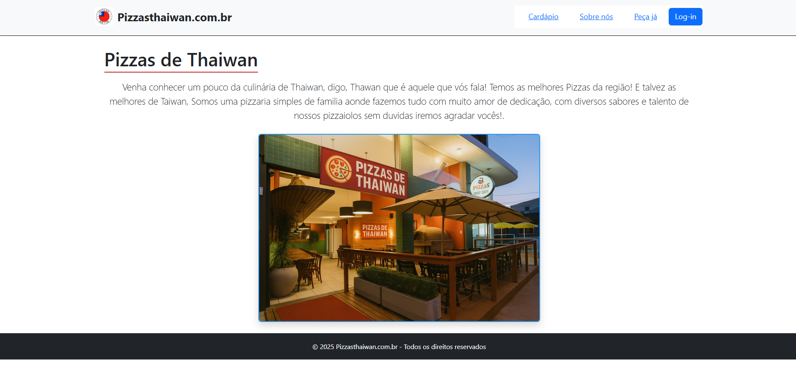
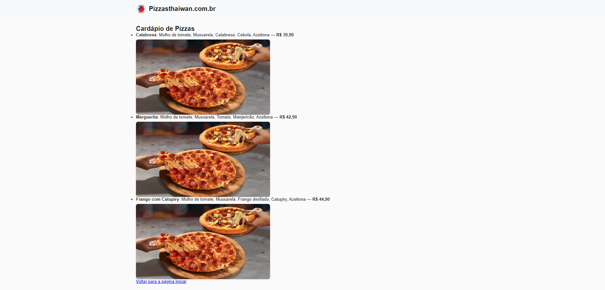

# Trabalho Prático 05 - Semanas 7 e 8

**Páginas de detalhes dinâmicas**

Nessa etapa, vamos evoluir o trabalho anterior, acrescentando a página de detalhes, conforme o  projeto escolhido. Imagine que a página principal (home-page) mostre um visão dos vários itens que existem no seu site. Ao clicar em um item, você é direcionado pra a página de detalhes. A página de detalhe vai mostrar todas as informações sobre o item do seu projeto. seja esse item uma notícia, filme, receita, lugar turístico ou evento.

Leia o enunciado completo no Canvas. 

**IMPORTANTE:** Assim como informado anteriormente, capriche na etapa pois você vai precisar dessa parte para as próximas semanas. 

**IMPORTANTE:** Você deve trabalhar e alterar apenas arquivos dentro da pasta **`public`,** mantendo os arquivos **`index.html`**, **`styles.css`** e **`app.js`** com estes nomes, conforme enunciado. Deixe todos os demais arquivos e pastas desse repositório inalterados. **PRESTE MUITA ATENÇÃO NISSO.**

## Informações Gerais

- Nome:Thawan Anthony Lourenço Silva
- Matricula: 1594182
- Proposta de projeto escolhida: Pizzaria 
- Breve descrição sobre seu projeto: É um projeto de site de Pizzaria basiada em um trocadilho com o nome do propietario

## Print da Home-Page

## Print da página de detalhes do item

git add .

## Cole aqui abaixo a estrutura JSON utilizada no app.js

const cadastro = {
  nome: "João Silva",
  telefone: "11999999999",
  endereco: {
    rua: "Rua das Pizzas",
    numero: 123,
    bairro: "Centro",
    cidade: "São Paulo",
    estado: "SP"
  },
  favorito: "Pizza de Calabresa"
};

console.log(cadastro);

// Cardápio de Pizzas
const cardapio = [
  {
    nome: "Calabresa",
    ingredientes: ["Molho de tomate", "Mussarela", "Calabresa", "Cebola", "Azeitona"],
    preco: 39.90
  },
  {
    nome: "Marguerita",
    ingredientes: ["Molho de tomate", "Mussarela", "Tomate", "Manjericão", "Azeitona"],
    preco: 42.90
  },
  {
    nome: "Frango com Catupiry",
    ingredientes: ["Molho de tomate", "Mussarela", "Frango desfiado", "Catupiry", "Azeitona"],
    preco: 44.90
  }
];

console.log(cardapio);

const pedido = {
  cliente: {
    nome: "Maria Oliveira",
    telefone: "11988887777"
  },
  enderecoEntrega: {
    rua: "Rua das Flores",
    numero: 456,
    bairro: "Jardim Primavera",
    cidade: "São Paulo",
    estado: "SP"
  },
  pizzas: [
    {
      sabor: "Calabresa",
      tamanho: "Grande",
      quantidade: 1
    },
    {
      sabor: "Marguerita",
      tamanho: "Média",
      quantidade: 2
    }
  ],
  pagamento: {
    forma: "Cartão de Crédito",
    total: 125.70
  },
  observacoes: "Sem cebola na Marguerita"
};

console.log(pedido);